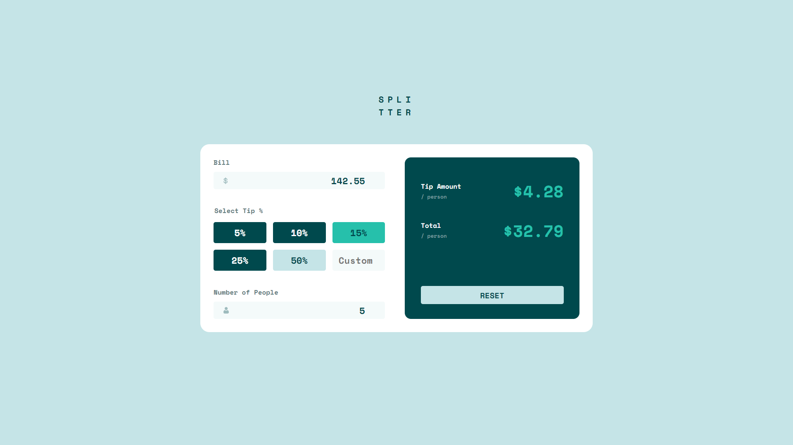

# Frontend Mentor - Tip calculator app solution

This is a solution to the [Tip calculator app challenge on Frontend Mentor](https://www.frontendmentor.io/challenges/tip-calculator-app-ugJNGbJUX). 

## Table of contents

- [Overview](#overview)
  - [The challenge](#the-challenge)
  - [Screenshot](#screenshot)
  - [Links](#links)
- [My process](#my-process)
  - [Built with](#built-with)
  - [What I learned](#what-i-learned)
  - [Continued development](#continued-development)
  - [Useful resources](#useful-resources)

## Overview

### The challenge

Your task is to build out the project to the designs inside the `/design` folder. You will find both a mobile and a desktop version of the design. 

The designs are in JPG static format. Using JPGs will mean that you'll need to use your best judgment for styles such as `font-size`, `padding` and `margin`. 

Users should be able to:

- View the optimal layout for the app depending on their device's screen size
- See hover states for all interactive elements on the page
- Calculate the correct tip and total cost of the bill per person

### Screenshot

I've inlcluded 4 screenshots in the `/screenshots` folder: mobile, tablet, desktop, and fullscreen.

### Links

- [Solution URL](https://www.frontendmentor.io/solutions/mobilefirst-using-bem-flexbox-css-grid-and-vanilla-js-71IKl_vqZ)
- [Live Site URL](https://victor-nyagudi.github.io/tip-calculator-app/)

## My process

I started with the HTML while observing the desktop version then wrote the CSS for the mobile version and
expanded from there. 

The functionality using JavaScript came last after the layout and most of the hover states, active, focus, 
etc. were complete.

### Built with

- Semantic HTML5 markup
- CSS custom properties
- Flexbox
- CSS Grid
- Mobile-first workflow
- Vanilla JS

### What I learned

It was nice to include some functionality beyond just validation or changing text in the DOM for a change. The calculation provided a good challenge, and I learned how to implement a calculator that returns values which are then displayed on the page. 

I went back and forth on which `<input>` type to use. I initially went with `<input type="button">` but ran into
the issue of the value being a string, which I couldn't use in calculations. Furthermore, I had to include the 
percentage in the `value` attribute meaning I'd have to remove it before doing any math.

One alternative was to use a dropdown list with `<select>`, but then I'd have to style it in such a way that looked
nothing like a dropdown list. The reasoning behind this was that since the user could only select one option, a 
dropdown list would work here. 

Another alternative was `<input type="radio">`, but this meant I'd have to find a way to remove its `list-style`, which I don't think is possible (or a good idea). 

I eventually went with a regular `<button>` where I could set the `value` to a number and the text displayed inside
the button to something else without mixing the two. 

All in all, I also learned quite a bit about these other inputs I ended up not using, and I've included the 
resource in the [useful resources](#useful-resources) section below.

The JavaScript was also challenging in a good way. I initially had some trouble deciding whether to add another
event listener to the reset button, but I chose to just use the `onClick` function. 

Finally, I learned about accesibility and incorporated this knowledge in my solution. 

### Continued development

I kind of went over the 4 to 6-hour limit I had for this.

The good news is I completetd the layout stuff and styling in that window with change to spare, but as I got into the JavaScript, I went back and forth trying different inputs to see which worked best, losing time in the process.

Either way, Im satisfied with how long I spent on this challenge. The knowledge gained in completing it beats 
the achievement of doing it in time any day of the week.

I'm glad I got to practice with forms, and I'm getting better at it too, but I wouldn't mind getting some more
reps in. 

I also wouldn't mind practicing implementing accessibility in future challenges as well. 

Overall, I am content with the way things turned out. 

### Useful resources

- [HTML Forms](https://www.w3schools.com/html/html_forms.asp) - I referred to this often throughout the challenge to brush up on inputs, form elements, etc.
- [Accessibility](https://developer.mozilla.org/en-US/docs/Web/Accessibility) - Great in-depth article on accessibility. It helped me gain a better understanding on doing my best to make the web more accessible for all. 